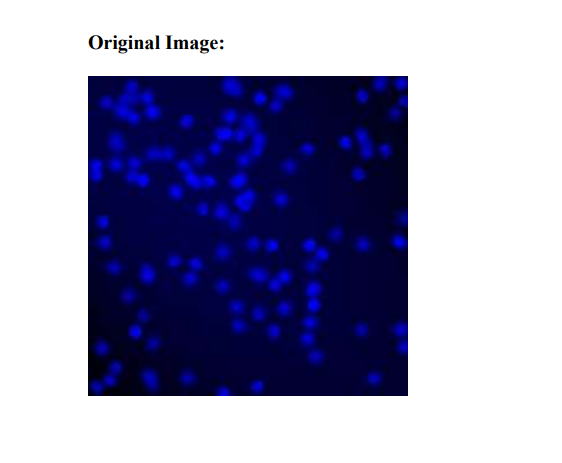
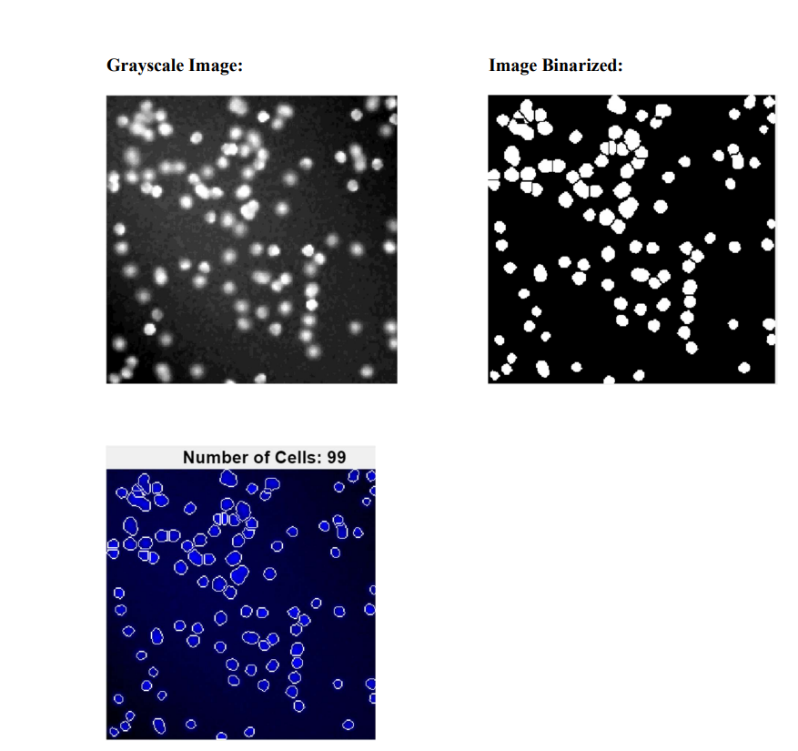

# Medical Image Analysis for Automatic Bacterial Cell Counting

## 📌 Project Overview

This project demonstrates an automated approach for detecting and counting bacterial cells in fluorescence microscopy images using MATLAB. The application combines image preprocessing, segmentation, and automated cell counting techniques to improve efficiency and accuracy in quantitative microbiology.

---

## 🎯 Objectives

- Automate bacterial cell counting from fluorescence microscopy images.
- Improve image quality using preprocessing techniques.
- Segment bacterial cells from the background.
- Reduce manual counting through image analysis.
- Develop an interactive MATLAB application.

---

## ✨ Features

- Load fluorescence microscopy images
- Image preprocessing
- Noise reduction
- Contrast enhancement
- Image thresholding
- Morphological operations
- Cell segmentation
- Automated bacterial cell counting
- MATLAB graphical user interface (GUI)

---

## 🛠️ Technologies Used

- MATLAB
- MATLAB Image Processing Toolbox
- Medical Image Analysis
- Digital Image Processing

---

## 🔄 Workflow

```text
Fluorescence Microscopy Image
            │
            ▼
       Load Image
            │
            ▼
   Image Preprocessing
   • Median Filtering
   • Contrast Enhancement
   • Grayscale Conversion
            │
            ▼
     Cell Segmentation
   • Thresholding
   • Morphological Operations
            │
            ▼
      Cell Detection
            │
            ▼
 Automated Cell Counting
            │
            ▼
   Results Visualization
```

---

## 🔄 Project Workflow

### Step 1 – Load Image
Import a fluorescence microscopy image into the MATLAB application.

### Step 2 – Image Preprocessing
Improve image quality by:
- Applying median filtering
- Enhancing image contrast
- Converting the image to grayscale

### Step 3 – Cell Segmentation
Separate bacterial cells from the background using thresholding and morphological operations.

### Step 4 – Cell Detection
Identify individual bacterial cells from the segmented image.

### Step 5 – Automated Cell Counting
Automatically count the detected bacterial cells, reducing the need for manual counting.

### Step 6 – Results Visualization
Display the processed image with detected bacterial cells and the total cell count using the graphical user interface.

---

## 🔬 Methods Used

- Median Filtering
- Contrast Enhancement
- Grayscale Conversion
- Image Thresholding
- Morphological Operations
- Image Segmentation
- Automated Cell Counting

---

## 💡 Skills Demonstrated

- Medical Image Analysis
- MATLAB Programming
- Image Processing
- Image Segmentation
- Computer Vision
- GUI Development
- Algorithm Development
- Quantitative Image Analysis

---

## 📊 Results

### Original Fluorescence Microscopy Image



### Processed Image




The application successfully detects and segments bacterial cells from fluorescence microscopy images, enabling efficient and reproducible automated cell counting.

---

## 📚 References

- Gonzalez, R. C., & Woods, R. E. *Digital Image Processing (3rd Edition).*
- LeCun, Y., Bengio, Y., & Hinton, G. *Deep Learning.* Nature, 2015.

---

## 🎓 Academic Information

Developed as part of **MATH 6346 – Medical Image Analysis** at **The University of Texas at Dallas**.

---

## 👤 Author

**Shradha Upadhyay**
````


